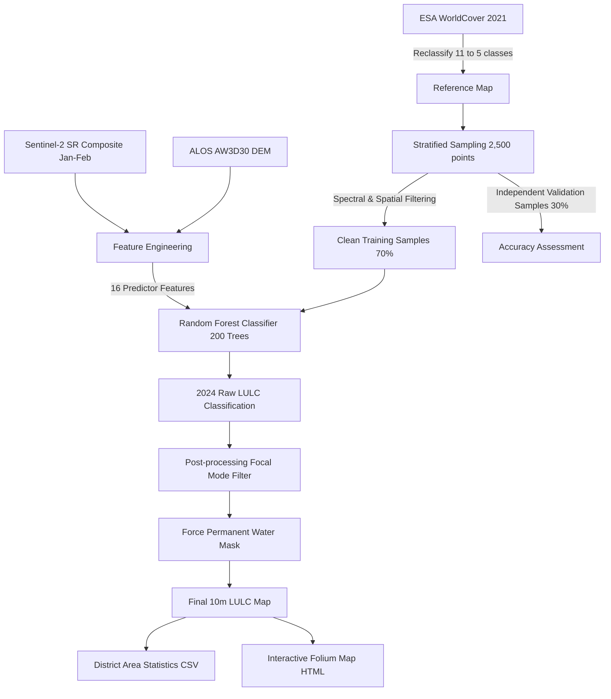
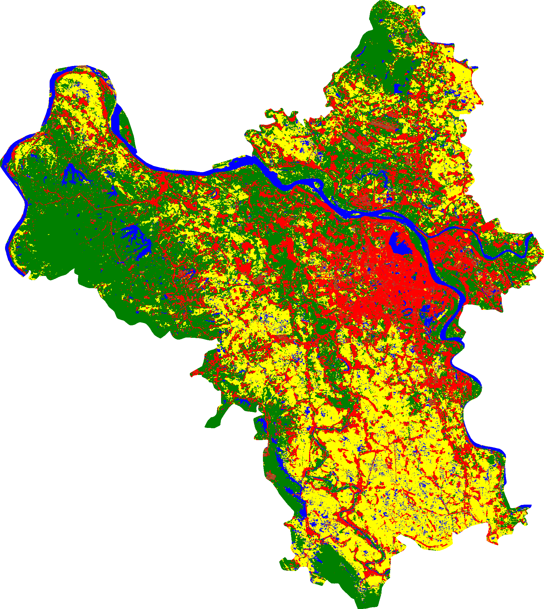

# 🌍 Hanoi Land Use & Land Cover (LULC) Classification & Interactive Dashboard

[](https://github.com/TungDucVu/LULC_HANOI/actions/workflows/run_classification.yml)


An academic-grade, end-to-end Machine Learning pipeline on Google Earth Engine (GEE) integrating **Sentinel-2 multispectral imagery**, **ALOS DEM topography**, and **ESA WorldCover reference maps** to perform 10m high-resolution Land Use / Land Cover (LULC) classification for Hanoi, Vietnam in 2024 (using training data from 2021 + ESA 2021 LULC to classify for 2024).

---

## 🚀 Project Overview

This repository hosts a production-ready spatial data science pipeline designed to map, validate, and analyze LULC patterns across the 29 administrative districts of Hanoi. By training a **Random Forest classifier (200 trees)** and applying advanced post-processing mode and vector-masking filters, the pipeline achieves high spatial accuracy and produces an interactive analytical dashboard.

### Key Highlights:
* 🛰️ **GEE Integration**: Cloud-powered Sentinel-2 Surface Reflectance (Level-2A) image processing.
* 🌲 **ALOS DEM Topography**: Spatial enrichment using 30m resolution elevation and slope data resampled to 10m.
* 📊 **Stratified Sampling**: Automatic training point generation based on the static ESA WorldCover 2021 map, refined with physical spectral indices filters.
* 🗺️ **Interactive Dashboard**: High-fidelity HTML mapping interface displaying district boundaries, tooltips, class area breakdowns, and urbanization indices.

---

## 📈 Model Performance & Accuracy Assessment

Validated against an independent **30% test split** of filtered stratified samples:
* 🎯 **Overall Accuracy (OA)**: **83.48%**
* 📉 **Kappa Coefficient**: **0.7930**

### Confusion Matrix
| Actual \ Predicted | Water (0) | Urban (1) | Agriculture (2) | Greenery (3) | Bare Land (4) |
| :--- | :---: | :---: | :---: | :---: | :---: |
| **Water (0)** | **533** | 0 | 18 | 0 | 5 |
| **Urban (1)** | 2 | **353** | 18 | 34 | 61 |
| **Agriculture (2)** | 16 | 16 | **344** | 54 | 11 |
| **Greenery (3)** | 1 | 32 | 57 | **347** | 2 |
| **Bare Land (4)** | 1 | 41 | 17 | 0 | **383** |

---

## 🛠️ Pipeline Architecture

The workflow details the progression from cloud-based imagery collection to local dashboard generation:



---

## 🔬 Classification Methodology & Predictors

### 1. Predictor Features (16 Bands & Indices)
| Category | Feature Name | Description | Source / Formula |
| :--- | :--- | :--- | :--- |
| **Spectral Bands** | `B2`, `B3`, `B4`, `B8`, `B11`, `B12` | Blue, Green, Red, Near-Infrared (NIR), Shortwave Infrared (SWIR-1, SWIR-2) | Sentinel-2 L2A |
| **Spectral Indices** | `NDVI` | Normalized Difference Vegetation Index (Vegetation density) | $\frac{B8 - B4}{B8 + B4}$ |
| | `NDBI` | Normalized Difference Build-up Index (Urban intensity) | $\frac{B11 - B8}{B11 + B8}$ |
| | `MNDWI` | Modified Normalized Difference Water Index (Open water) | $\frac{B3 - B11}{B3 + B11}$ |
| | `EVI` | Enhanced Vegetation Index (Dense canopy structure) | $2.5 \times \frac{B8 - B4}{B8 + 6 \times B4 - 7.5 \times B2 + 1}$ |
| | `SAVI` | Soil Adjusted Vegetation Index (Sparse vegetation correction) | $\frac{B8 - B4}{B8 + B4 + 0.5} \times 1.5$ |
| | `BSI` | Bare Soil Index (Barren/exposed soil enhancement) | $\frac{(B11 + B4) - (B8 + B2)}{(B11 + B4) + (B8 + B2)}$ |
| **Topographics** | `elevation` | Elevation above sea level (m) | ALOS AW3D30 DEM |
| | `slope` | Slope gradient (degrees) | Derived from ALOS DEM |
| **Temporal** | `NDVI_stdDev` | Annual standard deviation of NDVI (Cropland dynamics) | Standard deviation of 12-month Sentinel-2 series |
| **Texture** | `B8_contrast` | GLCM Contrast of NIR Band (Spatial texture contrast) | Grey-Level Co-occurrence Matrix (1px window) |

### 2. ESA WorldCover Reclassification Schema
| Target Class | Label | Reclassified from (ESA WorldCover 2021 Classes) | Color Palette |
| :---: | :--- | :--- | :---: |
| **0** | Water | Open water (80) | 🔵 Blue (`#0000ff`) |
| **1** | Urban | Built-up (50) | 🔴 Red (`#ff0000`) |
| **2** | Agriculture | Cropland (40) | 🟡 Yellow (`#ffff00`) |
| **3** | Greenery | Trees (10), Shrubland (20), Grassland (30), Herbaceous wetland (90), Moss & lichen (95) | 🟢 Green (`#008000`) |
| **4** | Bare Land | Barren / sparse vegetation (60), Mangroves (100) | 🟤 Brown (`#a0522d`) |

### 3. Noise & Mismatch Spectral Filters
To eliminate reference label noise caused by seasonal mismatches (e.g., dry river sandbars mislabeled as Water by the static ESA WorldCover map), physical index filters are applied during training point collection:
* **Water Samples**: Must satisfy `MNDWI > -0.05`.
* **Greenery Samples**: Must satisfy `NDVI > 0.25`.
* **Bare Land Samples**: Must satisfy `MNDWI < 0` and `NDVI < 0.3`.

---

## 📁 Repository Deliverables

The repository is structured to separate automation logic from visualization assets:

```text
LULC_Hanoi_2021_2024/
├── data/                             # Data inputs, boundaries, and static map resources
│   ├── hanoi_districts.geojson       # Hanoi district boundary coordinates (199 KB)
│   ├── hanoi_districts.js            # GeoJSON wrapped in JS for offline/CORS-free loading
│   ├── hanoi_lulc_2024.png           # Static 10m raster LULC classification overlay
│   └── hanoi_lulc_district_areas.csv  # Output district-level area statistics (km²)
│
├── classify_hanoi.py                 # Main Python script for pipeline execution
├── classify_hanoi.ipynb              # Detailed Jupyter Notebook pipeline with cell outputs
├── index.html                        # Interactive Folium map with district boundaries & LULC overlay
└── README.md                         # Project documentation
```

* 📄 **[classify_hanoi.py](classify_hanoi.py)**: Python automation script executing the classification pipeline from start to finish.
* 📊 **[data/hanoi_lulc_district_areas.csv](data/hanoi_lulc_district_areas.csv)**: Detailed area statistics ($km^2$) for the 5 LULC classes calculated at 10m scale for the 29 districts of Hanoi.
* 🖼️ **[data/hanoi_lulc_2024.png](data/hanoi_lulc_2024.png)**: Static 10m-resolution LULC classification raster exported from GEE.
* 🌐 **[index.html](index.html)**: Interactive Folium map displaying Hanoi district boundaries, hover-activated tooltips showing urbanization rates, and the 5-class LULC overlay.

---

## 🗺️ Static Classification Preview

The final 10m-resolution LULC classification output for Hanoi (2024), showing urban density along the Red River:



---

## ⚙️ Setup & Execution

### 1. Requirements & Dependencies
Ensure your python environment (Python 3.10+) has the required libraries installed:
```bash
pip install earthengine-api geemap folium geopandas pandas rasterio
```

### 2. Google Earth Engine Authentication
The script automatically detects GEE credentials:
* **Service Account**: Place your JSON service account key at `data/gen-lang-client-0520567475-9e431df4d813.json` or export it to the `EE_SERVICE_ACCOUNT_KEY` environment variable.
* **User Authentication**: If no service account key is found, the script defaults to standard user authentication (`ee.Authenticate()`).

### 3. Running the Pipeline
Run the script to fetch image composites, execute the classifier, save the statistics CSV, and render the interactive Folium dashboard:
```bash
python classify_hanoi.py
```
